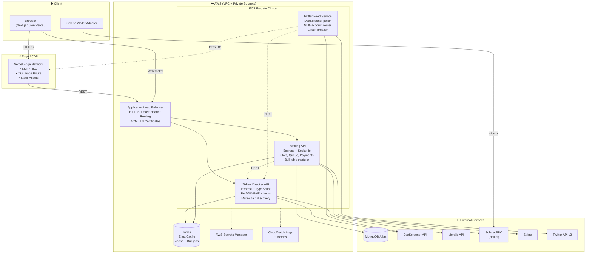
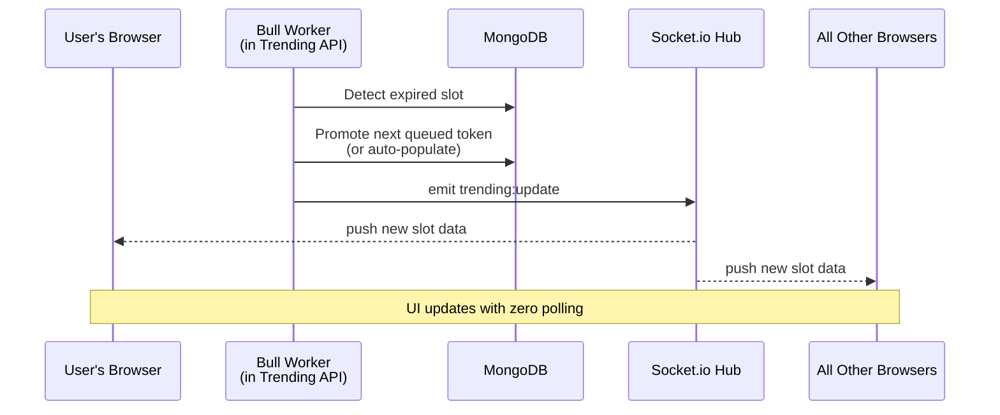

<!-- markdownlint-disable MD033 MD041 -->


# CheckDEX

> A production multi-chain token verification and trending platform — real-time DEX payment status, on-chain payment settlement, and continuously auto-populated trending slots across six blockchains.

[](https://nextjs.org/)
[](https://react.dev/)
[](https://www.typescriptlang.org/)
[](https://nodejs.org/)
[](https://aws.amazon.com/fargate/)
[](https://www.mongodb.com/)
[](https://redis.io/)
[](https://socket.io/)
[](https://solana.com/)
[](https://stripe.com/)
[](https://vercel.com/)

**Live App:** [https://checkdex.xyz](https://checkdex.xyz)

---

## Overview

CheckDEX answers a deceptively simple question — *"has this token actually paid for its enhanced DexScreener listing, or is the UI lying to me?"* — and extends the answer into a full market-data surface: a live, self-refilling leaderboard of the most active tokens across **Solana, BSC, Ethereum, Base, Polygon, and Blast**.

The platform solves three problems simultaneously:

1. **Verification.** Users paste any token address (Solana base58 or any EVM 0x-address) and the system auto-detects the chain, confirms the listing's payment status, and surfaces canonical metadata (holders, market cap, socials, logo).
2. **Discovery.** Eleven trending slots (one premium "Top Spot" + ten regular) are continuously kept fresh by an auto-population engine that blends cross-chain trending tokens. Empty slots never stay empty.
3. **Monetization.** Projects can purchase trending placement with **SOL, USDC, or credit card (Stripe)**. Every on-chain purchase is independently re-verified server-side before a slot is granted — the frontend is never trusted.

All of this runs on a service-oriented architecture deployed on AWS ECS Fargate, with the frontend on Vercel and a Socket.io channel pushing real-time updates to every connected browser.

---

## 1. High-Level Architecture

The platform is split into **three backend microservices** plus a **Next.js frontend**, communicating exclusively over HTTP/REST and WebSocket (no direct inter-service imports). Shared state lives in MongoDB (business data) and Redis (cache + job queues).



### Real-Time Update Flow

Every slot mutation — purchase, expiration, queue promotion, auto-population — fans out to every connected browser within seconds:



---

## 2. Tech Stack & Tooling

### Frontend (`checkdex-v2/`)

| Category | Stack |
|---|---|
| Framework | **Next.js 16** (App Router, RSC), **React 19** |
| Language | **TypeScript 5** (strict) |
| Styling | **Tailwind CSS v4** (CSS-based config, flexbox-only layout, desktop-first max-width breakpoints) |
| Real-time | **socket.io-client** |
| Web3 | **@solana/web3.js**, **@solana/wallet-adapter** (Phantom, Solflare, + backpack) |
| Tokens | **@solana/spl-token** (USDC SPL transfer) |
| Imagery | **Vercel OG** (`ImageResponse` + Satori), **sharp** |
| Animation | **GSAP** |
| Hosting | **Vercel** (Edge Functions, preview deployments per branch) |

### Backend Services (`services/`)

| Service | Purpose | Stack |
|---|---|---|
| `token-checker-api` | PAID/UNPAID checks, token metadata, cross-chain trending discovery | Express · TypeScript · ioredis · zod · winston |
| `trending-api` | Slot lifecycle, queue, on-chain payment verification, Stripe, WebSocket broadcasts, scheduled jobs | Express · Socket.io · Mongoose · **Bull** · ioredis · joi |
| `dex-twitter-feed-service` | Poll DexScreener, tweet new paid tokens with generated OG images, multi-account load balancing | twitter-api-v2 · custom circuit breaker |

### Data & Messaging

| Layer | Technology |
|---|---|
| Primary datastore | **MongoDB Atlas** (Mongoose ODM) |
| Cache + job queues | **Redis** (AWS ElastiCache, `allkeys-lru` eviction) |
| Background jobs | **Bull** (recurring auto-fill, expiration, queue promotion, nightly cleanup) |
| Real-time transport | **Socket.io** (WebSocket over ALB) |
| Email | **Nodemailer** (SMTP) |
| Chat alerts | **Telegram Bot API** |

### Web3 / Payments

| | |
|---|---|
| On-chain payments | **SOL** & **USDC (SPL)** on Solana, verified server-side against Solana RPC |
| Card payments | **Stripe Checkout** (+ webhook verification) |
| Chain support | Solana, BSC, Ethereum, Base, Polygon, Blast |
| Wallet UX | Solana Wallet Adapter (modal + auto-reconnect) |

### Infrastructure & DevOps

| | |
|---|---|
| Compute | **AWS ECS Fargate** (per-service tasks, `linux/amd64` images) |
| Networking | **AWS ALB** with HTTPS listeners, **host-header-only** rule routing, ACM TLS |
| Container registry | **Amazon ECR** (`latest` + `staging` tags) |
| DNS / TLS | **Route 53** + **ACM** |
| Secrets | **AWS Secrets Manager** (no secrets in container env) |
| Logging & Metrics | **CloudWatch Logs** + periodic memory heartbeat lines for alarms |
| Frontend hosting | **Vercel** (production = `full-rebuild` branch, staging = `staging` branch) |
| Security headers | **Helmet** + explicit CORS allowlist |
| Rate limiting | **express-rate-limit** backed by **rate-limit-redis** (distributed across tasks) |

---

## 3. Core Technical Challenges & Solutions

> The three deep-dives below describe *conceptual architecture*, not implementation. No proprietary thresholds, weights, or business rules are disclosed.

### Challenge A — Continuously Auto-Populating a Multi-Chain Trending Leaderboard

**The problem.** A trending grid with eleven slots must never appear empty or stale. Slots come in two flavors: **paid** (a project purchased the placement) and **auto-populated** (algorithmic fill). Both must coexist in a single rendered list, sort differently, and refresh in real time — all while pulling from six different blockchains with wildly different volume profiles and without ever showing a token that is already in another slot.

**The conceptual approach.**

1. **Cross-chain candidate discovery.** A dedicated discovery service in the Token Checker API queries market-data providers per chain and normalizes the shape of each result (Solana, BSC, Ethereum, Base, Polygon, Blast each have different raw schemas). Tokens below minimum volume, liquidity, or maximum age constraints are discarded up front.
2. **Composite scoring.** Each surviving candidate is assigned a score derived from a weighted blend of four signals: **traded volume**, **recency** (newer launches are boosted), **on-chain liquidity**, and **short-window price momentum**. The weights are tuned to reward tokens that are *actually moving right now* rather than legacy high-volume assets.
3. **Balanced multi-chain representation.** The candidate pool is intentionally blended so that a single hot chain (usually Solana memecoins) cannot monopolize the grid. The result is a mix that reflects the breadth of the ecosystem, not just one chain's weekly mania.
4. **Duplicate-proof slot assignment.** Before inserting an auto-populated token, the service re-queries the database for tokens already occupying any active slot — **paid or unpaid, both flavors**. This is critical because multiple job instances can run concurrently; without this check, the same token could land in two slots during a scheduler race. The top-scoring candidate not already seated is taken first (for the Top Spot), then regular slots are filled in descending score order.
5. **Two sort orders in one list.** Paid slots are sorted by **1-hour traded volume** (giving real-time social proof to paying customers), while auto-populated slots are sorted by the composite score above. The frontend renders them as a single grid, but the sort keys are segregated by the `isPaid` boolean — a small invariant that cleanly separates product logic from infrastructure.
6. **Scheduled refresh.** A Bull worker re-runs the fill cycle on a short cadence. A separate volume-update worker refreshes the paid slots' sort key so the "hottest paid token" naturally floats to the top without requiring a new purchase.

The effect from the user's perspective: the grid is *alive*. Tokens rotate, market-cap badges flicker, and the top of the leaderboard looks different every time you visit — because it is.

---

### Challenge B — Trust-less On-Chain Payment Verification with a Queue Fallback

**The problem.** Selling trending placement for real money (SOL, USDC, or card) over a stateless HTTP API creates a classic web3-meets-web2 trust problem: the browser sends the backend a transaction signature, but the browser is **hostile input**. You cannot believe that a signature corresponds to a real payment, to the right recipient, for the right amount. And when all slots are sold out, you need a fair way to absorb demand rather than refunding.

**The conceptual approach.**

1. **Client-signed, server-verified.** The user's wallet signs a transaction locally using Solana Wallet Adapter. The frontend submits the transaction to the Solana network **and** sends the resulting signature to the backend. The backend is never asked to trust what the frontend *says* the payment was — it only trusts what it can **independently read from the chain**.
2. **Multi-property on-chain check.** The payment service fetches the confirmed transaction from Solana RPC and verifies four properties in sequence:
   - The transaction **exists and is finalized**.
   - The **recipient** matches the expected project-controlled wallet (loaded from AWS Secrets Manager, not env vars).
   - The **amount** satisfies the price for the requested slot type and duration, priced at the moment of purchase (SOL prices fetched from a hot cache with a short TTL).
   - The signature has **never been used before** (replay protection via a uniqueness constraint on `confirmationSignature`).
3. **Card parity.** For credit-card purchases, Stripe Checkout is used, and the post-checkout flow verifies the Stripe session server-side rather than trusting any browser state. Same trust boundary, different rails.
4. **Queue when slots are full.** If verification succeeds but there is no open slot of the requested type, the purchase is placed into a **priority queue** in MongoDB rather than refunded. Each queue entry carries a priority derived from slot type and submission time.
5. **Automatic promotion.** A Bull worker runs a short-interval expiration + promotion cycle: when an active slot ends, the queue is drained head-first, the next entry is converted into a live slot, and a **Socket.io broadcast** fans the change out to every connected browser. The newly-promoted customer sees their token go live without a page refresh — and so does every other user watching the leaderboard.
6. **Notifications close the loop.** Email (via SMTP) and Telegram alerts go out on successful purchases, promotions, and failures, so operators have an auditable stream outside of CloudWatch.

The result is a payment pipeline that behaves like a traditional checkout — idempotent, auditable, refund-free — while using crypto rails and never trusting the client.

---

### Challenge C — Host-Header-Only ALB Routing (a Production Incident Retrospective)

**The problem.** In front of the ECS Fargate cluster sits a single AWS Application Load Balancer serving multiple hostnames: a production API host, a trending API host, a staging variant of each, and the usual mess of TLS certificates. A natural first instinct when writing ALB listener rules is to be **defensively specific** — match on both the host header *and* a path-pattern whitelist, because "only these paths should be reachable." This instinct is exactly wrong, and it caused an outage.

**What broke.** A listener rule was configured as:

```text
Priority 10:
  Host:  api.example-domain.xyz
  Path:  /v1/token/*, /v1/check/*, /v1/tokens/*
  → forward to: Token Checker target group
```

This looked tighter than a host-only rule. But when new endpoints were later added to the Token Checker service (`/v1/evm/*`, `/v1/analytics/*`, `/v1/trending/stats`), those paths **did not match the whitelist**, fell through to the ALB's default rule, and were quietly forwarded to an entirely different service on a different target group. The wrong service responded with its own authentication policy, so calls came back as 401/403 with a response body shape that did not match either service — making the bug look like a CORS issue, then a container issue, then an auth issue. Staging worked (different rule set), production did not. Classic misrouting mirage.

**The conceptual fix.**

1. **Ownership model.** If a hostname is dedicated to exactly one service, the listener rule should match on **host-header only** — no path-pattern. The hostname already expresses the ownership; any path on that host *must* belong to that service.
2. **Path-patterns have one legitimate use.** They are appropriate only when a single host is intentionally split across multiple target groups (e.g. `/api/*` → API, `/admin/*` → admin service). In that case, use **prefix patterns**, never exhaustive enumerations.
3. **Fail loud, not silent.** A missing path should 404 on the *correct* service, not 401 on the *wrong* one. Host-only routing guarantees this property.
4. **Environment isolation remains tight.** Multi-environment isolation is still enforced — production and staging have distinct hostnames on the same ALB, and each rule still includes a host-header condition. The only thing removed is the path-pattern whitelist.

**The broader lesson.** Enumerating allowed paths at the load balancer looks like "defense in depth" but is really a **coupling between infrastructure and application routing**. Every new endpoint becomes a cross-team deployment concern. Moving route authorization into the service itself (via its own middleware and authn/authz stack) restores a clean layering: the ALB owns *which service* a request reaches; the service owns *which endpoint* it exposes. This outage, and the audit that followed it, produced the runbook entry: **"A host-dedicated ALB rule must be host-only. If you're tempted to whitelist paths at the ALB, you're describing a service boundary in the wrong place."**

---

## 4. Security & Infrastructure Highlights

### Security posture

- **Secrets never touch source or container env.** All credentials — Moralis API key, Stripe secrets, MongoDB URI, Telegram bot token, Solana RPC URL — are pulled from **AWS Secrets Manager** at task start. Separate secrets per environment (production vs staging).
- **Payment trust boundary.** The backend is the only authority on whether a payment is valid. Client-submitted transaction signatures are **independently re-read from the chain** before any slot is granted, with recipient, amount, and replay checks.
- **Per-signature uniqueness.** On-chain transaction signatures are uniquely indexed in MongoDB to make replay attacks impossible even under concurrent requests.
- **Rate limiting** is distributed across ECS tasks via `express-rate-limit` backed by Redis, so scaling out does not dilute limits.
- **Helmet + explicit CORS allowlist**, with a small but critical middleware-ordering rule: CORS registers **before** Helmet, with `trust proxy` enabled so the ALB's `X-Forwarded-*` headers are respected.
- **Circuit breaker on external APIs.** The Twitter feed service trips after a small number of consecutive 429 responses from a given account and enters a one-hour cooldown, automatically rotating to an alternate account. This turns a hard rate-limit ban risk into a graceful degradation.
- **Multi-account load balancing** for Twitter: community-style links route to one account, profile-style links to another, and tokens with no social links are skipped entirely rather than spammed.

### Infrastructure hardening (all from real post-mortems)

- **Memory-safe task sizing.** Node processes in ECS tasks are launched with an explicit `--max-old-space-size` that is strictly *less than* the container's memory limit. If a memory leak is ever reintroduced, V8 triggers a clean OOM → ECS restarts the task, instead of the task silently pegging at 100% CPU via GC thrashing.
- **The `finally { clearTimeout }` rule.** A production degradation was traced to a `Promise.race([work, setTimeout(15s)])` pattern where the losing timer and its closure leaked per request. The canonical pattern in this codebase now hoists every race timer into a `let` outside the `try` block and clears it in `finally` on every exit path (success, timeout, throw). A small convention with outsized reliability impact.
- **Redis eviction discipline.** The ElastiCache parameter group is pinned to `allkeys-lru` (not the default `volatile-lru`) because Bull's scheduled-job hashes have no TTL. Paired with explicit `removeOnComplete` / `removeOnFail` on every Bull queue, this caps unbounded key growth that would otherwise OOM the cluster after several months.
- **Logical DB separation** is planned between production and staging Bull queues; the current sharing is a documented known-risk tracked in the runbook.
- **Docker platform pinning.** All images are built with `--platform linux/amd64`. ARM-on-Mac build artifacts will not run on Fargate, and the resulting `CannotPullContainerError` is one of the more expensive ways to waste an afternoon.
- **Health checks are explicit.** Every ECS task definition declares a `curl -f` health check against its real liveness endpoint (`/v1/health` or `/health`), and `curl` is installed in the Dockerfile rather than assumed.
- **CloudWatch memory heartbeats.** Each service emits a structured memory log line once per minute, enabling alarms on RSS growth trends rather than just on instantaneous failure.
- **Host-header-only ALB routing** (see Challenge C) — now the project convention for any host dedicated to a single service.
- **TLS everywhere.** ACM certificates on every hostname, HTTPS-only listener rules, WebSocket upgraded over WSS.

---

## Repository Layout

```text
check-dex/
├── checkdex-v2/                    # Next.js 16 frontend (Vercel)
│   └── src/
│       ├── app/                    # App Router pages + /api/og-dex route
│       ├── components/             # HomePage, TopSpot, TrendingTokenCards, modals
│       ├── hooks/trending/         # useTrendingAPI, useTrendingWebSocket, usePayment
│       └── contexts/               # WalletProvider (Solana wallet-adapter)
│
├── services/
│   ├── token-checker-api/          # PAID/UNPAID + multi-chain discovery (port 3001)
│   ├── trending-api/               # Slots, queue, payments, WebSocket (port 3400)
│   └── dex-twitter-feed-service/   # Twitter bot + circuit breaker (port 5960)
│
└── infrastructure-docs/            # Private: AWS topology, incidents, runbooks
```

---

## Status

| Surface | Status |
|---|---|
| Production frontend | 🟢 Live — [https://checkdex.xyz](https://checkdex.xyz) |
| Production backend (Fargate) | 🟢 Running on ECS — ALB + Redis + MongoDB Atlas |
| Staging environment | 🟢 Parallel stack on same ALB with host-header isolation |
| Real-time updates | 🟢 Socket.io over WSS |
| Multi-chain support | 🟢 Solana + BSC + Ethereum + Base + Polygon + Blast |

---

<sub>This README is written for technical hiring managers and reviewers. Implementation details, internal thresholds, and proprietary business logic are intentionally omitted. For inquiries, see the live app.</sub>
